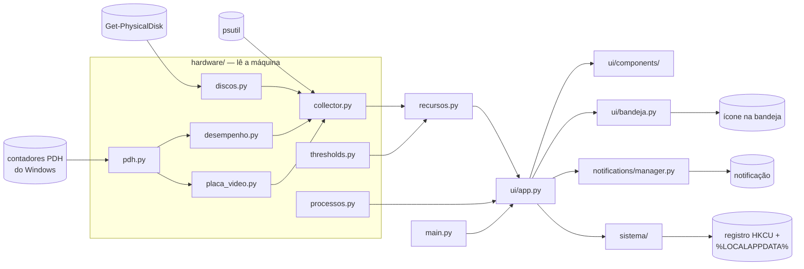

# Monitor de Hardware


Um monitor que responde a uma pergunta só: **dá para continuar usando o computador em
paz agora?**

Em vez de números que só técnico interpreta, cada recurso tem um semáforo — verde,
amarelo ou vermelho — e uma frase em português dizendo o que está acontecendo e o que
fazer. Se estiver tudo verde, não há nada a fazer.

## Funcionalidades

- **Cinco cartões com semáforo:** CPU, RAM, Disco, Temperatura estimada e Placa de vídeo.
- **Textos sem jargão.** "Espaço em disco acabando. Apague arquivos grandes ou mova para
  outro lugar." — não "Disk usage: 96%".
- **Avisos que dizem o culpado.** Quando a CPU satura, a notificação nomeia o programa que
  está consumindo: "chrome.exe está usando 78% da CPU."
- **Disco com todas as unidades.** Olha todas as unidades fixas, avisa por percentual **e**
  por espaço livre em GB, e detecta sinais de desgaste do disco físico. Clicar no cartão
  alterna entre as unidades.
- **Aviso de calor.** Quando o processador diminui a própria velocidade para não esquentar,
  o cartão de Temperatura diz isso — sem mudar de cor, porque não há o que fazer a respeito.
- **Ícone ao lado do relógio**, colorido pelo estado geral. Fechar a janela esconde o app
  ali; ele continua vigiando.
- **Abrir junto com o Windows**, opcional e reversível por um interruptor na própria janela.
- **Modo claro e modo escuro.**

## Usando o programa

Esta é a forma normal de usar: **não precisa instalar Python nem nada**.

1. Baixe o `MonitorDeHardware.exe` na [página de versões](https://github.com/ArthurFigg/hardware_monitor/releases/latest).
2. Coloque onde quiser — Documentos, Área de Trabalho, uma pasta sua. O programa **não tem
   instalador**: não escreve em `Arquivos de Programas` e não aparece em "Adicionar ou
   remover programas". Se depois você mudar o arquivo de pasta, ele se ajusta sozinho na
   abertura seguinte.
3. Clique duas vezes.

**Na primeira vez o Windows vai mostrar um aviso de segurança** ("O Windows protegeu o seu
computador"), com "Não executar" em destaque. Clique em **Mais informações** e depois em
**Executar assim mesmo**. Isso acontece com qualquer programa sem assinatura digital, e só
na primeira execução.

Depois de aberto:

- **Fechar a janela não fecha o programa** — ele vai para o ícone ao lado do relógio e
  continua vigiando. Na primeira vez que isso acontece, o app avisa.
- Para **abrir de novo**, clique no ícone.
- Para **encerrar de verdade**, clique com o botão direito no ícone e escolha **Sair**.

**Para desinstalar:** desligue o interruptor "Abrir junto com o Windows" na janela,
escolha **Sair** no menu do ícone e apague o arquivo. Desligar o interruptor antes de
apagar é a parte que importa — é a única coisa que o programa deixa registrada fora da
própria pasta. Sobra ainda uma pasta minúscula em
`%LOCALAPPDATA%\MonitorDeHardware`, com uma linha de texto; apagar é opcional.

O programa **não pede senha de administrador** e **não acessa a internet**.

## Rodando a partir do código

Só é necessário para desenvolver ou para gerar o executável.

**Pré-requisitos:** Windows, [uv](https://docs.astral.sh/uv/) e Python 3.12 ou mais novo
(o projeto é desenvolvido no 3.14).

```bash
git clone https://github.com/ArthurFigg/hardware_monitor.git
cd hardware_monitor
uv sync
uv run main.py
```

Para gerar o executável e testá-lo localmente:

```bash
uv run pyinstaller monitor.spec --noconfirm
```

Sai em `dist/MonitorDeHardware.exe`, arquivo único de cerca de 20 MB. O `.exe` precisa
estar fechado antes de reconstruir — o Windows trava o arquivo em execução.

**O executável que se distribui não é esse.** Empurrar uma tag `vX.Y.Z` faz o GitHub
Actions compilar num Windows limpo e publicar o Release com o arquivo e o hash SHA-256
anexados. Gerando à mão, o que se publica é o que alguém lembrou de reconstruir.

## Arquitetura

<!-- diagrama:inicio -->


O dado entra pelo Windows em tres portas diferentes, `hardware/` o transforma em leitura,
`recursos.py` decide o status e o texto, e `ui/app.py` so distribui — sem conhecer o nome
de nenhum recurso. `thresholds.py` e importado por quase todo modulo; o desenho mostra so
a seta que define o caminho do dado.
<!-- diagrama:fim -->

## Estrutura do projeto

```
hardware_monitor/
├── hardware/          # lê a máquina e classifica o que leu
│   ├── collector.py   # junta tudo num ciclo de coleta
│   ├── thresholds.py  # os limites e o que cada faixa significa
│   ├── discos.py      # unidades fixas e saúde do disco físico
│   ├── pdh.py         # contadores de desempenho do Windows, via ctypes
│   ├── desempenho.py  # velocidade real do processador
│   ├── placa_video.py # uso da placa de vídeo
│   └── processos.py   # quem está consumindo, sob demanda
├── ui/                # a janela
│   ├── app.py         # monta os cartões e distribui o que foi coletado
│   ├── bandeja.py     # ícone ao lado do relógio
│   └── components/    # cartão e semáforo
├── sistema/           # integração com o Windows fora da leitura de hardware
│   ├── inicializacao.py   # entrada na chave Run (abrir com o Windows)
│   ├── instancia_unica.py # uma cópia por vez; a segunda mostra a janela da primeira
│   ├── caminhos.py        # onde estão os arquivos do app, empacotado ou não
│   ├── estado.py          # o pouco que o app lembra, em %LOCALAPPDATA%
│   └── uptime.py          # há quanto tempo a máquina está ligada
├── notifications/     # notificações do sistema
├── recursos.py        # o que o app vigia e o que ele diz sobre cada coisa
├── main.py            # ponto de entrada
├── monitor.spec       # build do executável
└── tests/             # testes por camada
```

## Decisões técnicas

- **Informação que não vira semáforo não vira cartão.** Só ganha cartão o que tem limite
  com significado e muda de cor. Velocidade de rede não tem: 5 MB/s satura uma internet de
  50 mega e é nada numa de 500. Cartões de rede, de programas na inicialização e de número
  de processos foram cortados por esse critério, não por falta de espaço.

- **Toda leitura de hardware esconde a si mesma quando falha.** As leituras foram validadas
  numa máquina só. Em Windows mais antigo, em outro idioma ou num PC sem placa dedicada,
  elas podem não responder — e aí a linha ou o cartão inteiro somem. Nunca aparece erro,
  nunca derruba o app.

- **Nada do app é gravado na pasta do app.** Tudo vai para `%LOCALAPPDATA%`. Gravar ao lado
  do executável é o caminho mais curto e quebra nos dois cenários que importam: a pasta do
  projeto não existe na máquina de quem instalou, e na máquina do autor ela fica dentro do
  OneDrive.

- **Um lugar só descreve cada recurso, e a tela não conhece recurso por nome.** Cada
  recurso é descrito uma vez em `recursos.py` — classificação, textos, se notifica, formato
  do valor. Acrescentar um recurso é uma entrada, não três. Custo aceito: o arquivo fica na
  raiz, e não em `hardware/` nem em `ui/`, porque carrega texto de interface e regra de
  classificação ao mesmo tempo — quem procurar por camada não acha de primeira.

- **O que a tela mostra e o que o app decide são coisas separadas.** O cartão de Disco
  deixa escolher qual unidade olhar, mas a notificação e a cor do ícone continuam vindo da
  pior. Sem isso, escolher o disco saudável desligaria o aviso do disco cheio, e nada na
  tela denunciaria.

- **O contador do Windows se resolve por número, com queda para o nome em inglês.** Os
  nomes são traduzidos por idioma: `% Processor Performance` vira "% de Desempenho do
  Processador" num Windows em português. Alguns contadores não são traduzidos e só existem
  em inglês. Os dois caminhos são necessários.

- **Ação que a pessoa pediu nunca falha em silêncio, nos dois sentidos.** Leitura que falha
  se esconde; interruptor que falha, não. Se ligar não ligou ou desligar não desligou, o
  controle volta ao que o sistema de fato tem e uma linha explica.

- **O app não tem configuração.** Limites não são ajustáveis, e isso é decisão, não
  esquecimento: para escolher um bom limite a pessoa precisa saber o que é um bom limite, e
  quem sabe disso não precisa deste app. A única exceção é o interruptor de abrir com o
  Windows.

## Testes

```bash
uv run pytest -v
```

São 392 testes, rodando em cerca de 7 segundos. A regra é **lógica coberta, fronteira
mockada**: toda regra de decisão tem teste com valores simulados, e leitura real de
hardware é sempre substituída por mock. Ficam sem teste automatizado, por não serem
testáveis, o desenho do ícone da bandeja e o comportamento dos contadores do Windows em
outras máquinas.

## Dependências

| Pacote | Versão | Uso |
|---|---|---|
| psutil | >=7.2.2,<8.0.0 | CPU, memória, discos e processos |
| customtkinter | >=5.2.2,<6.0.0 | interface gráfica |
| pystray | >=0.19.5,<0.20.0 | ícone na bandeja do sistema |
| Pillow | >=12.3.0,<13.0.0 | desenha o ícone da bandeja e do executável |
| plyer | >=2.1.0,<3.0.0 | notificações do Windows |

Desenvolvimento: `pytest`, `ruff` e `pyinstaller`.

## Licença

[MIT](LICENSE) — use, modifique e distribua à vontade, inclusive comercialmente, mantendo
o aviso de copyright.
